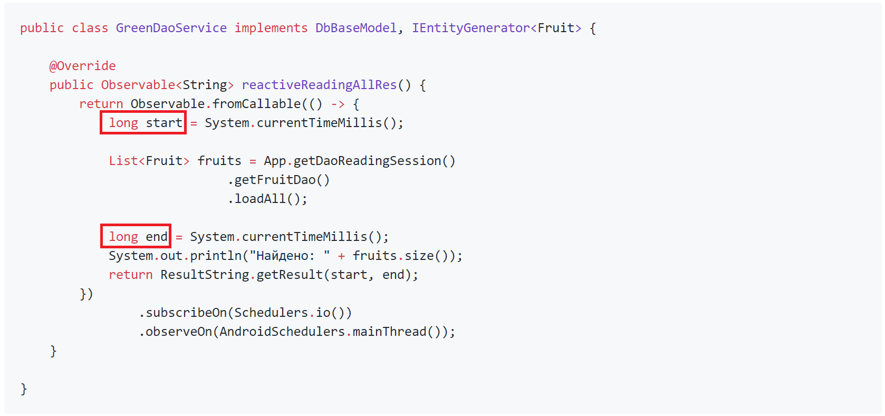
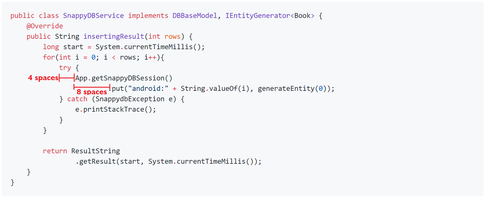
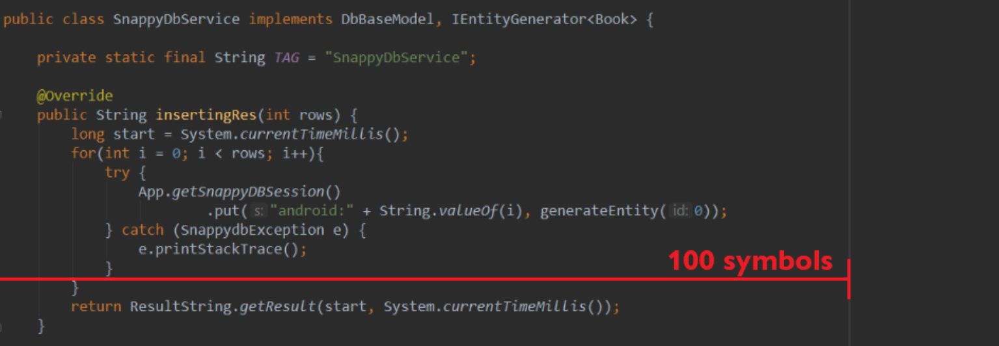

# Android code convention

### Content
1. [Comments/javadoc](#comments_javadoc)<br>
2. [Short methods](#short_methods)<br>
3. [Methods name](#methods_name)<br>
4. [Fields](#fields)<br>
5. [Local variables](#local_variables)<br>
6. [Imports](#imports)<br>
7. [Indents](#indents)<br>
8. [String length](#string_length)<br>
9. [Braces](#braces)<br>
10. [Reductions](#reductions)<br>
11. [TODO and FIXME](#TODO_and_FIXME)<br>
12. [Consistency](#consistency)<br>
13. [Resources files](#resources_files)<br>
14. [Android components classes](#android_components_classes)<br>
15. [Packages](#packages)<br>
16. [Project package](#project_package)<br>
17. [Package structure](#package_structure)<br>

<a name="comments_javadoc"><h2>Comments/javadoc</h2></a>

Each class and public method must contain Javadoc, with at least one phrase describing what it does.
<br>For example:
<br> 
```java
public interface DbBaseModel {

    /**
     * Returns String with insert result
     * @param rows insert string count
     */
    String insertingResult(int rows);

}
```

<a name="short_methods"><h2>Short methods</h2></a>

Methods should be small and decisives specific tasks, as far as possible.
<br>For example:
```java
public class RealmService implements IEntityGenerator<Car>{  
  
    @Override  
    public Car generateEntity(long id) {  
        Car car = new Car();  
        car.setColor("Black");  
        car.setFuelCapacity(113);  
        car.setPrice(666);  
        car.setId(id);  
  
        return car;  
    }  
  
} 
```

<a name="methods_name"><h2>Methods name</h2></a>

The method names must be verbs written according to the CamelCase principle. Method names should not contain abbreviations, unless these abbreviations are abbreviations or acronyms.
<br>For example:
```java
// YES 
@Override  
public String insertingResult(int rows) {  
    return null;  
}  
// NO
@Override  
public String insertingRes(int rows) {  
    return null;  
} 
```

<a name="fields"><h2>Fields</h2></a>

The fields must be at the top of the file, or right before the method that uses them. 
<br>Private non-static fields must begin with the letter ```m```. 
<br>Private and static fields must begin with the letter ```s```.
<br>All names of fields, classes, methods should be written according to the principle of CamelCase.
<br>Constant field is writing with uppercase and with ```_```.
For example:
```java
public class HomeActivity extends MvpAppCompatActivity{  
  
    private AppCompatSpinner mSpinnerDB;  
    private AppCompatSpinner mSpinnerType;  
    private TextView mDbResultView;  
    private Button mSubmitButton;  
    private EditText mInputRows;  
    private EditText mInputId;  
    public static final int CONSTANT_NUMBER = 5;  
    DBResultPresenter mDbResultPresenter;  
    private static Singlton sSinglton;  
  
} 
```

<a name="local_variables"><h2>Local variables</h2></a>

The scope of local variables must be kept to a minimum. Each variable must be declared in the deepest block that surrounds all possible places of use of the variable.
<br>&#9;Local variables must be declared in the place, where it is first necessary to use it.
<br>&#9;For example: 
<br>

<a name="imports"><h2>Imports</h2></a>

The ordering of import statements is:
<br>    1. Android imports.
<br>    2. Imports from third parties (com, junit, net, org).
<br>    3. java and javax packages.
<br>Imports must be:
<br>    - Alphabetical within each grouping.
<br>    - Capital letters before lower case letters (e.g. Z before a).
<br>    - Separated by a blank line between each major grouping.
<br>For example: 
```java
import android.os.Bundle;  
import android.support.v7.widget.AppCompatSpinner;  
import android.text.TextUtils;  
import android.widget.ArrayAdapter;  
import android.widget.Button;  
import android.widget.EditText;  
import android.widget.TextView;  
import android.widget.Toast;  
  
import com.arellomobile.mvp.MvpAppCompatActivity;  
import com.arellomobile.mvp.presenter.InjectPresenter;  
import com.ilya.litosh.roomvsrealm.R;  
import com.ilya.litosh.roomvsrealm.presenters.DBChooserPresenter;  
import com.ilya.litosh.roomvsrealm.presenters.DBResultPresenter;  
import com.ilya.litosh.roomvsrealm.presenters.TypeChooserPresenter;  
import com.ilya.litosh.roomvsrealm.views.DBChooserView;  
import com.ilya.litosh.roomvsrealm.views.DBResultView;  
import com.ilya.litosh.roomvsrealm.views.TypeChooserView;  
  
import java.util.List; 
```

<a name="Indents"><h2>Indents</h2></a>

It is required to use 4 spaces for blocks. And also 8 spaces for the wrap of lines, including calls to functions and assignments.
<br>For example: 


<a name="string_length"><h2>String length</h2></a>

Each text string in code must be no longer 100 symbols.
<br>For example: 


<a name="braces"><h2>Braces</h2></a>

Braces do not go on their own line, they go on the same line as the code before them.
<br>For example:
```java
public class SampleClass {  
    public void do(){  
    }
} 

```

<a name="reductions"><h2>Reductions</h2></a>

Abbreviations and acronyms should be written as words.
<br>For example:
```java
// YES  
public class GreenDaoService implements DbBaseModel, IEntityGenerator<Fruit> {  
  
}  
// NO
public class GreenDAOService implements DBBaseModel, IEntityGenerator<Fruit> {  
  
}  
```

<a name="TODO_and_FIXME"><h2>TODO and FIXME</h2></a>

It is required to use TODO comments for code that is temporary, a short-term solution, or good-enough but not perfect. 
<br>Use FIXME for code that must be subject to change.
<br>For example:
```java
public class GreenDaoService implements DbBaseModel, IEntityGenerator<Fruit> {  
      
    @Override  
    public String readingAllResult() {  
        long start = System.currentTimeMillis();  
        List<Fruit> fruits = App.getDaoReadingSession()  
                .getFruitDao()  
                .loadAll();  
        long end = System.currentTimeMillis();  
        // TODO use it, if you need show found fruits count  
        /* FIXME: System.out.println("Найдено: " + fruits.size()); */ 
        return ResultString.getResult(start, end);  
    }  
  
} 
```

<a name="consistency"><h2>Consistency</h2></a>

If you change the code, then look to look at the code around you and determine its style. If spaces are used in it, then you should use them. If the comments contain a small set of asterisks, then you should use them.

<a name="resources_files"><h2>Resources files</h2></a>
Drawable files:

| Type          | Prefix             | Example                  |
|:-------------:|:------------------:|:------------------------:|
| Action bar    | ab_                | ab_stacked.9.png         |
| Button        | btn_               | btn_send_pressed.9.png   |
| Dialog        | dialog_            | dialog_top.9.png         |
| Divider       | divider_           | divider_horizontal.9.png |
| Icon          | ic_                | ic_star.png              |
| Menu          | menu_              | menu_submenu_bg.9.png    |
| Notification  | notification_      | notification_bg.9.png    |
| Tab           | tab_               | tab_pressed.9.png        |
<br>
Choose state:

| State         | Suffix             | Example                  |
|:-------------:|:------------------:|:------------------------:|
| Normal        | _normal      | btn_order_normal.9.png   |
| Pressed       | _pressed     | btn_order_pressed.9.png  |
| Focused       | _focused     | btn_order_focused.9.png  |
| Disabled      | _disabled    | btn_order_disabled.9.png |
| Selected      | _selected    | btn_order_selected.9.png |
<br>

Layout files:
<br>The layout files must match the Android сomponents for which they were intended, but transfer the component name from the previous level to the begin. For example, if we create a layout for the name ```SignInActivity```, there must be a file name of the ```activity_sign_in.xml``` layout
<br>Menu files:
<br>Like the layout files, the menu files must match the name of the component. For example, if we define a menu file that will be used in the ```UserActivity``` file, then the file name must be ```activity_user.xml```. It's best practice not to include the word menu as part of the name, because these files are already in the menu directory.


<a name="android_components_classes"><h2>Android components classes</h2></a>

For classes that extend the Android component, the class name must end with the component name. 
<br>For example: ```SignInActivity```, ```SignInFragment```, ```ImageUploaderService```, ```ChangePasswordDialog```.

<a name="packages"><h2>Packages</h2></a>

The package name must contain the reversed domain of your organization. For example, the name of the ```com.google.docs``` package indicates that the developer of ```google.com``` created the ```docs``` package. Also the name of the package should be written in all capital letters. In the case when there is a dash in the domain name or a collision with the name of a primitive type is expected, it is necessary to add a lower underscore. 
<br>For example: with the domain name ```int.dev-google.com``` and the ```docs``` package, the package name will look like: ```com.dev_google._int.docs```.

<a name="project_package"><h2>Project package</h2></a>

In the directory of your application should be the following structure:
- app
  - manifests
  - java
  - res
  
<br>Open the ```manifests```:<br>
- app
  - manifests
    - AndroidManifest.xml
    
<br>The ```manifests``` folder contains ```AndroidManifest.xml```, which is a required app file. It, for example, contains information about the activities used in the app or information about the intent-filters, through which other apps can call yours app.
<br>```java``` folder contains:
- app
  - java
    - ```[reversed domain name].[project name]```
    - ```[reversed domain name].[project name](androidTest)```
    - ```[reversed domain name].[project name](test)```

<br>packages with the source code of the project as well as packages with tests.
<br>The res folder contains project resources:
- app
  - res
    - drawable
    - layout
    - mipmap
    - values

<br>This is the list of the main packages in the res folder, as well as various packages of the type ```anim```, ```menu``` and others can be added if possible. The ```drawable``` package contains raster and vector resources, as well as various xml-figures. The ```layout``` package contains markup files. The ```mipmap``` contains application icons for various screen resolutions. The ```values``` package stores various values for ```styles```, ```colors```, ```lines```, etc.

<a name="package_structure"><h2>Package structure</h2></a>

#### MVC pattern
Packages, that use the MVC pattern will structure like:
- package1
  - Class1Model
  - Class1Controller
  - Class1View
- package2
  - Class2Model
  - Class2Controller
  - Class2View

<br>The classes in the package must depend on each other.

#### MVP pattern
Packages, that use the MVP pattern will structure like::
- package_name1
  - models
    - Class1Model
    - Class2Model
  - views
    - IView1
    - Class1View
    - IView2
    - Class2View
  - presenters
    - Class1Presenter
    - Class2Presenter
- package_name2
  - models
    - Class1Model1
    - Class2Model2
  - views
    - IView11
    - Class1View1
    - IView22
    - Class2View2
  - presenters
    - Class1Presenter1
    - Class2Presenter2

#### MVVM pattern 
A packages structure, that uses the MVVM pattern:
- package_name1
  - models
    - Class1Model
    - Class2Model
  - views
    - adapters
    - ui
      …
  - viewmodels
    - Class1ViewModel
    - Class2ViewModel
- package_name2
  - models
    - Class1Model1
    - Class2Model2
  - views
    - adapters
    - ui
      …
  - viewmodels
    - Class1ViewModel1
    - Class2ViewModel2


